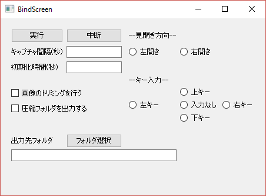

スクリーン製本
====
スクリーンキャプチャを自動で行って本のように製本するツールです。

## Description
キーボード入力とスクリーンキャプチャを指定した間隔で行います。画面に変化がなくなると自動的にスクリーンキャプチャを終了します。

オプションで画面分割、余白のトリミング、フォルダ圧縮をすることができます。特にタブレット端末で取り扱いやすい形式になります。


## Requirement
- Windows OS
- Python 3.0以上
- PIL(Python Imaging Library)

GUIを使う場合は以下のライブラリが追加で必要になります。
- PyQt4

## Usage
gui.pyかexec.batを実行すると次の画面が表示されます。




- 実行
  - プログラムを実行します。
- 中断
  - プログラムの実行を中断します。
- キャプチャ間隔
  - スクリーンショットをキャプチャする間隔を秒数で指定します。
- 初期化時間
  - 実行をクリックしてから実際にプログラムの動作が始まるまでの間隔を秒数で指定します。
- 見開き方向
  - トリミングしたときに左右どちらのページを前にするかを指定します。右が前のページなら右開きを指定します。
- キー入力
  - 実行するキーボード入力を指定します。
- 圧縮フォルダを出力する
  - 最終的な出力を圧縮して出力するかを指定します。
- 画像のトリミングを行う
  - 画像の分割、余白の削除を行うかを指定します。
- 出力先フォルダ
  - 出力先のフォルダを指定します。

またbind_screen.pyを実行することでコマンドで実行することもできます。

以下は引数の指定方法です。

```
bind_screen.py [-h] [--zip] [--trim]
                      dst_path instruction opening_direction [init_time]
                      [interval_time]

This script is to automate screen shots

positional arguments:
  dst_path           出力するファイルのパスを指定する。
  instruction        キーボードの命令をwin32API(SendKey)で指定する。←なら'{LEFT}'を指定する
  opening_direction  見開き方向を指定する。右開きなら'RIGHT'を指定する
  init_time          プログラムが最初に実行されるまでの時間を指定する(秒)
  interval_time      命令を送る間隔を指定する(秒)

optional arguments:
  -h, --help         show this help message and exit
  --zip              最終的な出力ファイルを圧縮して出力する
  --trim             画像の分割とトリミングを行う
```

処理が終了すると選択したディレクトリにフォルダが生成されます。
- spread_image
  - 未加工の画像が保存されたフォルダ
- split_image
  - 画面中央で縦に分割した画像が保存されたフォルダ(オプション指定時のみ)
- trim_image
  - split_imageの画像から余白を取り除いた画像が保存されたフォルダ(オプション指定時のみ)
- complete.zip
  - 「画像のトリミングを行う」をつけた場合はtrim\_imageの圧縮フォルダが出力され、つけなかった場合はspread\_imageの圧縮フォルダとなる(オプション指定時のみ)

### Note
出力フォルダと同じ名前のフォルダがディレクトリ内に存在する場合、プログラムを実行することができません。

## Licence
MIT License

## Author
[drilldripper](https://github.com/drilldripper)